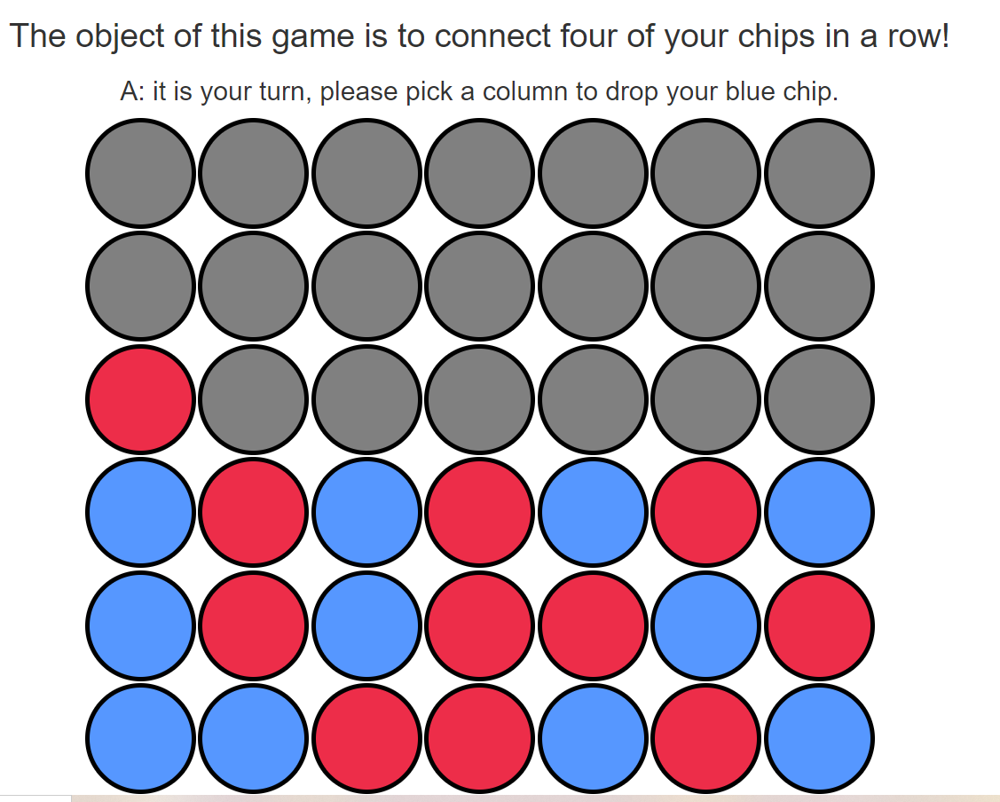

# DevSecOps-Connect-Four-Deployment

<div align="center">


</div>


# Connect Four

- This is a simple game which can be played between two players.The player who connects the four bubbles first wins the game . The bubbles could be connected horizontally , vertically or diagonally.The players have to be together since multiplayer feature is not available .

## Technologies Used :

- HTML

- CSS

- Javascript

- JQuery

## How to set-up:

- Clone this repo

- Open it in any Text Editor

- Enjoy it !!!




# 🚀 1. Run SonarQube Using Docker
## Step 1 — Pull SonarQube Image

```bash
docker pull sonarqube:latest
```

## Step 2 — Run SonarQube Container
```bash
docker run -d --name sonarqube \
  -p 9000:9000 \
  -v sonarqube_data:/opt/sonarqube/data \
  -v sonarqube_logs:/opt/sonarqube/logs \
  -v sonarqube_extensions:/opt/sonarqube/extensions \
  sonarqube:latest
```
SonarQube URL
http://localhost:9000

```bash
Default Login
Username: admin
Password: admin
```
## 🔑 2. Create SonarQube Token

- 1️⃣ Login → http://localhost:9000
- 2️⃣ Click profile (top right) → My Account
- 3️⃣ Go to: Security → Tokens
- 4️⃣ Enter token name: jenkins-token
- 5️⃣ Click Generate
- 6️⃣ Copy and save the token

## 🔧 3. Install Jenkins Plugins

Go to: 
Manage Jenkins → Plugins → Available

Install:

- SonarQube Scanner

- Pipeline

- Pipeline Utility Steps

- Docker Pipeline (important for docker login/build)

- Credentials Binding

## ⚙️ 4. Configure SonarQube in Jenkins

Go to:
Manage Jenkins → System

Scroll to SonarQube Servers → Click Add SonarQube

Fill:
```bash
Name: sonar-server
Server URL: http://sonar-ip:9000
```

Then click Add → Secret Text → Paste your SonarQube Token

Save as:
```bash
ID: sonar-token
```

Select that credential under Authentication Token.

Click Save.

## 🛠️ 5. Add SonarQube Scanner in Jenkins

Go to:
Manage Jenkins → Global Tool Configuration

Scroll to SonarQube Scanner

Add:
```bash
Name: sonar-scanner
Install Automatically: YES
```

Save.

## 🐳 6. Add Docker Hub Credentials in Jenkins

Go to Jenkins → Manage Jenkins → Credentials → System → Global credentials

Click Add Credentials →
```bash
Kind: Username with password

Username: Your Docker Hub username

Password: Your Docker Hub password

ID: docker-hub (or any name you like)

Description: Docker Hub login for pipeline
```
